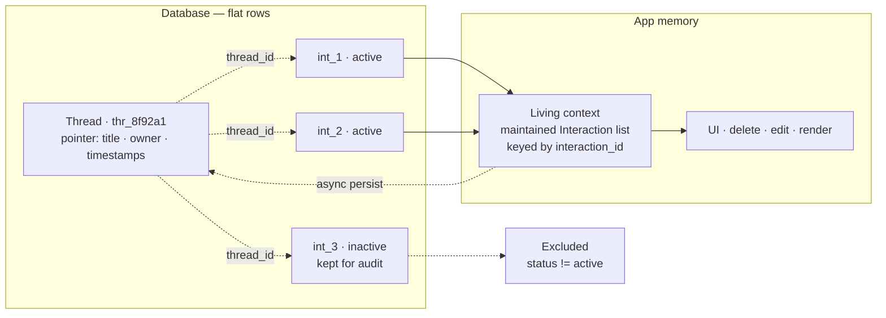

# Chat Design — Threads, Interactions & Runtime Context

**Related:** [thread-persistence-implementation.md](thread-persistence-implementation.md) · [pxo-user-api.md](pxo-user-api.md)

---

## At a glance



- **Thread** — a pointer: title, owner, timestamps. No history inside.
- **Interactions** — one prompt + response per flat row, linked by `thread_id`.
- **Living context** — the in-memory working copy of active exchanges while a thread is open.

---

## 1. Thread

A pointer document. No interaction history embedded.

```json
{
  "thread_id": "thr_8f92a1",
  "user_id": "usr_99x12",
  "active": true,
  "title": "Friendly Greeting Bot",
  "created_at": "2026-06-25T07:56:00Z",
  "updated_at": "2026-06-25T07:57:02Z",
  "context": {
    "updated_at": "2026-06-25T07:57:02Z",
    "workspace_id": "pxo",
    "active_route": "/alerts",
    "filters": { "severity": "critical" }
    "selected_alert_id": "alert_4421",
  }
}
```

---

## 2. Interaction

One exchange per flat row.

```json
{
  "interaction_id": "int_3c92b4",
  "thread_id": "thr_8f92a1",
  "status": "active",
  "model": "claude-4-sonnet",
  "prompt": {
    "text": "Hello, how are you?",
    "timestamp": "2026-06-25T07:57:00Z",
    "attachments": [
      {
        "id": "att_01",
        "type": "image/png",
        "url": "s3://bucket/file.png",
        "name": "file.png"
      }
    ]
  },
  "response": {
    "text": "I'm good, how are you?",
    "timestamp": "2026-06-25T07:57:02Z",
    "tokens_used": 45,
    "a2ui": { "root": "main-card", "components": [] }
  }
}
```

| Field                                | Description                                                     |
| ------------------------------------ | --------------------------------------------------------------- |
| `interaction_id`                     | Unique ID — the anchor for every context operation              |
| `thread_id`                          | Parent thread                                                   |
| `status`                             | Controls visibility everywhere (see below)                      |
| `prompt.text` / `prompt.attachments` | User message and any files                                      |
| `response.text`                      | Assistant reply                                                 |
| `response.a2ui`                      | Static A2UI snapshot — re-renders history without re-generating |

### Status

Only `active` shows in the UI and enters living context. Everything else stays in the DB for audit.

| Status                 | Visible | Meaning                       |
| ---------------------- | :-----: | ----------------------------- |
| `active`               |   ✅    | Current canonical exchange    |
| `pending`              |   ❌    | Response in flight            |
| `edited`               |   ❌    | Superseded — original kept    |
| `deleted`              |   ❌    | Soft-deleted — kept for audit |
| `archived`             |   ❌    | When a interaction is `edit` or `delete` the subsequent interaction s `archived` programmatically |
| `failed` / `cancelled` |   ❌    | Error or aborted              |

---

## 3. Runtime flow

| Action      | Living context (instant) | DB (async)                          |
| ----------- | ------------------------ | ----------------------------------- |
| Open chat   | Hydrate active rows      | Read once                           |
| New message | Append exchange          | Insert                              |
| Delete      | Remove by id             | Mark inactive                       |
| Edit        | Replace by id            | Mark old edited · insert new active |

Mutations always target a **whole exchange** (prompt + response together), not individual messages.

---

## 4. Living context (in memory)

**Living context** is the working copy of a conversation while it is open.

The database is the source of truth. Memory is the fast path. On open, load active exchanges once into an ordered in-memory list. On every user action, update that list immediately; persist to the database asynchronously.

|               | Database                  | Living context               |
| ------------- | ------------------------- | ---------------------------- |
| Purpose       | Durable storage and audit | UI, edits, and runtime reads |
| Contents      | All rows                  | Active exchanges only        |
| Update timing | Async                     | Instant                      |

Each exchange has a stable id. Delete, edit, and re-render use that id — not array indexes — so the same turn is addressable in the UI, in memory, and in the database.

What gets sent to the model on each prompt is a separate decision (e.g. last N exchanges, summarization). Living context holds the full active thread; the prompt may use a subset.

---

## Summary

- **Thread** = pointer. **Interaction** = one stored exchange.
- **Living context** = in-memory working copy while the thread is open.
- **Memory first, DB async.** Load once; mutate instantly; persist later.
- **Only `active` exchanges** appear in the UI and living context.
- **Deletes and edits** are status changes — rows are kept for audit.
